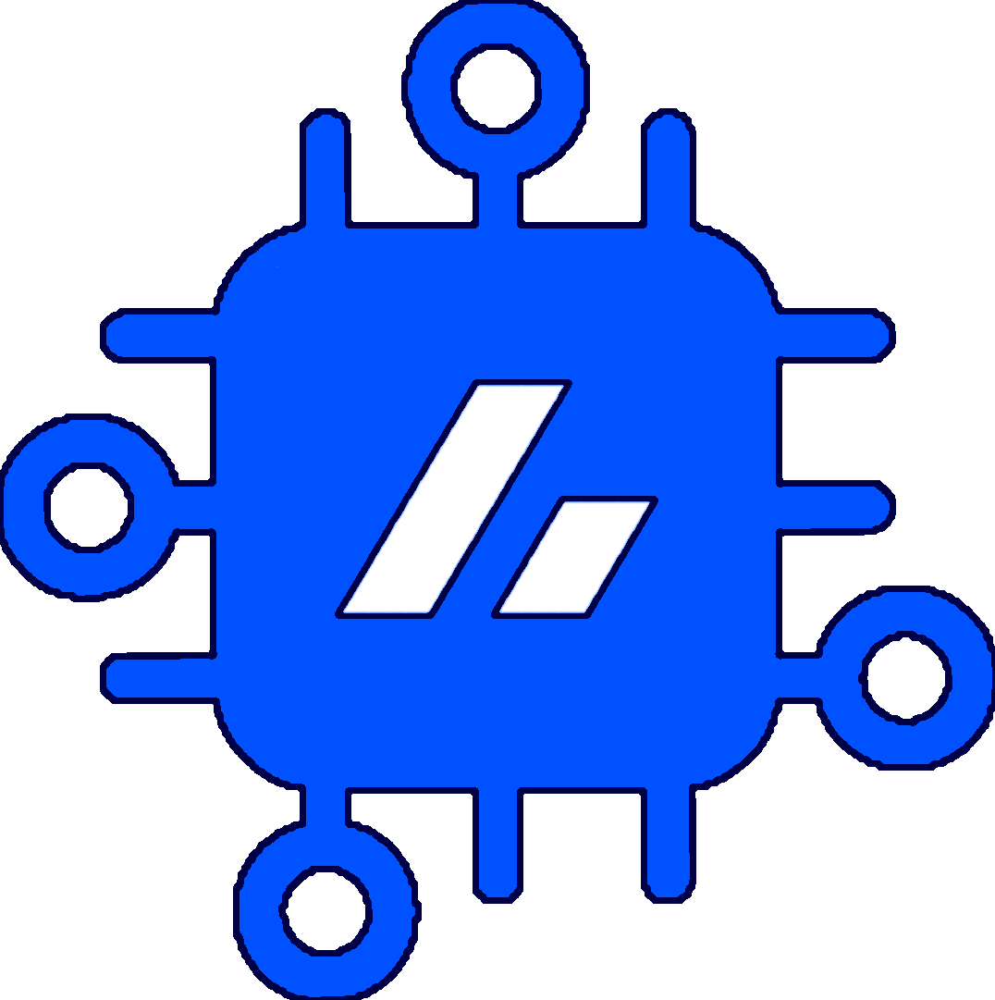
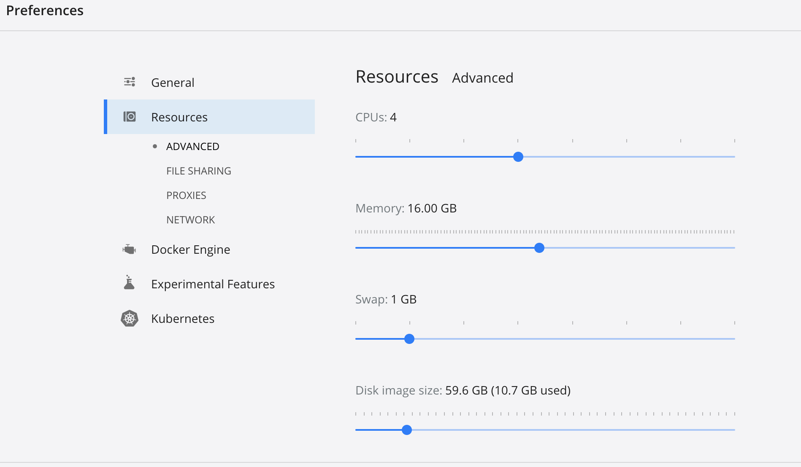
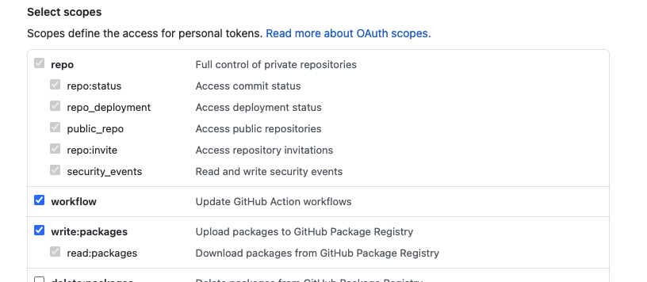

# BoxedOut Core API



## Description

BoxedOut Core API is a monorepo that includes different backend applications deployed separately.
It provides API for several boxedout clients and hosts some useful tools such as the BoxedOut CLI and the Kafka consumer.

### Partial list of features and tech stack used

- [GraphQL API Federation with NestJS](https://docs.nestjs.com/graphql/federation)
- AgGrid implementation with CRUD auto-generation mechanism that combines [Resolver](https://docs.nestjs.com/graphql/resolvers), [Service](https://docs.nestjs.com/providers#services), [Dataloader](https://github.com/graphql/dataloader) and [TypeORM Repository](https://docs.nestjs.com/recipes/sql-typeorm#repository-pattern) based on a [Factory pattern](https://en.wikipedia.org/wiki/Factory_method_pattern)
- Auto-generated REST API based on [GraphQL Sofa](https://www.sofa-api.com/) but internally customized
- CLI application to handle some ops such as database migrations and seeding (both locally and remotely)
- Monorepo integration by combining [NestJS Monorepo](https://docs.nestjs.com/cli/monorepo), [NPM workspaces](https://docs.npmjs.com/cli/v8/using-npm/workspaces) and [Github Action path filters](https://docs.github.com/en/actions/using-workflows/workflow-syntax-for-github-actions#onpushpull_requestpull_request_targetpathspaths-ignore)
- Logger (with Pino, Nest or console) and Sentry Integration by using NestJS [Event Emitter](https://docs.nestjs.com/techniques/events) and [Exception filters](https://docs.nestjs.com/exception-filters#exception-filters)
- [NestJS Kafka integration](https://docs.nestjs.com/microservices/kafka#kafka)
- [NCC compilation](https://github.com/vercel/ncc)
- Integration with docker-compose and [VSCode devcontainer](https://code.visualstudio.com/docs/remote/containers)
- Documentation with [Compodoc](https://compodoc.app/) and [Git-Wiki](https://github.com/Drassil/git-wiki)
- Eslint integration
- Auto-versioning mechanism based on PR by using the [action-package-version-bump](https://github.com/boxedout/action-package-version-bump)
- [GraphQL Voyager integration](https://github.com/APIs-guru/graphql-voyager)
- Custom Jest system with 100% unit test coverage and auto-generated e2e tests based on GraphQL Schema

### Reserved ports and useful URLs

Apps:

- [60101](http://localhost:60101): gateway
  - [GraphQL Playground](http://localhost:60101/graphql)
  - [Swagger REST API Documentation](http://localhost:60101/api-docs)
- [60102](http://localhost:60102): manage-panel
  - [GraphQL Playground](http://localhost:60102/graphql)
- [60103](http://localhost:60103/graphql): user-provider
  - [GraphQL Playground](http://localhost:60103/graphql)

Other services:

- [3000](http://localhost:3000/): Frontend (V3)
- [60001](http://localhost:60001/): documentation (you must run the serve command before)
- [60002](http://localhost:60002/): coverage (you must run the serve command before)
- [60003](http://localhost:60003/): mysql (use an external mysql client to connect)
- [60004](http://localhost:60004/): phpmyadmin (you must run the phpmyadmin docker service before)
- [60005](http://localhost:60005/): redis
- [60006](http://localhost:60006/): mysql-test
- [60300](http://localhost:60300/): backend-manage

**NOTE:** to change these configurations, please take a look at [How to configure docker](./docker-configuration.md)

### Configure your environment (first time):

1. **REQUIREMENTS:**

- Install [docker 4.3+](https://docs.docker.com/engine/install/) and [enable docker compose v2](https://docs.docker.com/compose/cli-command/#installing-compose-v2)

  - **For Mac OS Users:** For optimal performance, go to Docker preferences `Preferences... > Resources`, and increase the resources allocated to Docker. Try to use at least half of the Host Memory and 4 CPU cores

- Install [nodejs](https://nodejs.org/en/download/package-manager/) (16.x suggested), this is only used to run **npm** commands. All other dependencies will be provided by our docker image.

- Install npm 8+ : `npm install -g npm@8` (you probably need to run with sudo under linux)

- Install [git 2.15+](https://git-scm.com/book/en/v2/Getting-Started-Installing-Git)

  - **IMPORTANT FOR WINDOWS USERS**: to run the `npm scripts` of this project it's mandatory to use a `bash-like` shell. Git for Windows includes MinGW.
    To setup MinGW as default shell for npm run `npm config set script-shell "C:\\Program Files\\Git\\bin\\bash.exe"`
    Source: https://stackoverflow.com/a/58808786

- Install [VSCode +1.58](https://code.visualstudio.com/) , this guide doesn't work with a previous version


<br/>

2. **Run**: `docker network create local-shared-net`

3. Generate a [GitHub Personal Access Token](https://docs.github.com/en/github/authenticating-to-github/creating-a-personal-access-token), with the right scopes:


<br/>

and enable SSO on it

4. Create an environment variable in your system called `GITHUB_TOKEN` with the Github Generated Token, make sure this variable is available in your terminal. [How to setup env variables on your OS](https://www.schrodinger.com/kb/1842)

- **Note:** Alternatively, you can create a `.env` in the root of the project, instead, and add the environment variable there, it should be automatically loaded by Docker.

5. **Run**: `echo $GITHUB_TOKEN | docker login https://ghcr.io -u \<github_username> --password-stdin` (use bash)

6. **Run**:

- `git config --global submodule.recurse true` (mandatory to automatically download the submodules as well)
- `git config --global core.autocrlf input` this command is pretty mandatory to avoid issues with EOL before cloning and when using the container
- `git config --global fetch.prune true` to prune deleted branches automatically and keep you git repo clean

7. **Run**: `git clone --recurse-submodules https://github.com/boxedout/boxed-out-boilerplate.git && cd boxed-out-boilerplate`.

   **IMPORTANT**: if you already cloned it before then you can run `git pull --recurse-submodules` to download the submodules.

8. **Run**: `npm run docker:initdb` to create the databases

9. **Run**: `npm run docker:reseed` to seed the database with initial dummy data

10. **Modify**: your local OS hosts configuration to point the local domain to the application, add and reload your local dns config.

```
127.0.0.1 account.bob.local
127.0.0.1 db.bob.local
127.0.0.1 slave-db.bob.local
```

### Setup your environment for development:

To develop the boxed-out-boilerplate you should not run the `npm run docker:*` commands below, but instead you have to work directly within the container by using the VSCode dev-container feature (or locally if needed). Please check the [Development environment](./development-environment.md) documentation and follow those steps.

### Run the Application (ONLY FOR NON CORE-API DEVS):

1. **Run**: `npm run docker:start:d` to run it in background (`npm run docker:start` to run in foreground otherwise)

**NOTE:** by default all the projects of the monorepo are executed. If you need to run a specific project instead run `npm run docker:set:proj \\<project-id>` to switch your environment to the project you have to work on. The list of the projects available is basically the list of the list of the apps under the `/apps` folder

### Update the Application

Updating the applications can be done by updating the repo, installing new dependencies and migrating the database. To do it you have to:

1. `git pull --recurse-submodules` new changes from the repository remote branches.

2. **Run**: `npm run install:workspaces` within the docker shell (by running `npm run docker:shell` or using the vscode devcontainer).
   Alternatively, if you're on a main branch, you can run `npm run docker:update` it will pull the new image with all the dependencies preinstalled.

3. **Run**: `npm run typeorm:migrate` (from the docker shell) OR `npm run docker:migrate` (from the host shell).
   **DISCLAIMER:** where the application is in dev-stage, there could be the possibility that a proper migration has not been provided yet.
   In this case you will probably need to reset you local database by using `npm run typeorm:reset` (from the docker shell) or `npm run docker:resetdb` (from the host shell).

**NOTE:** every `docker:*` script available from the host has its relative script that can be run within the container. Check the **package.json** for the complete list of the available commands. We do not provide `docker:*` commands for every script we have, so if you want to run a particular script which is not allowed under the `docker:*` namespace
you can always use `npm run docker:shell` to jump into the `node-service` shell and run the command you need.

## Documentation index (Alphabetic order)

To start, set up your development environment, make sure that you know how to properly configure Docker and perform your first query on already existing resources.
To develop make sure you understand the entire lifecycle of a NestJS project, what naming conventions we use and how our logging system works.

After this you can follow any of the following sections, to start building things:

- [Application and Library Creation](./application-and-library-creation.md)

- [Application architecture](./application-architecture.md)

- [Application lifecycle](./application-lifecycle.md)

- [Authorization flow](./authorization-flow.md)

- [Database Connection Setup](./database-connection-setup.md)

- [Database Migration](./database-migration.md)

- [Database Seeding](./database-seeding.md)

- [Development environment](./development-environment.md)

- [Docker Configuration](./docker-configuration.md)

- [Error Handling](./error-handling.md)

- [Git Workflow and Versioning](./git-workflow-and-versioning.md)

- [Knowledge base](./knowledge-base.md)

- [Logging](./logging.md)

- [Naming conventions](./naming-conventions.md)

- [NestJS](./nestjs.md)

- [Pipeline](./pipeline.md)

- [Querying GraphQL](./querying-graphql.md)

- [References](./references.md)

- [Testing](./testing.md)

### Legacy/Deprecated

- [Legacy Endpoint creation](./legacy-endpoint-creation.md)

- [Legacy GraphQL Ag-grid](./legacy-graphql-aggrid.md)

### Other Commands:

- Docker:

  - Start other apps such as the frontend, the phpmyadmin etc. (check the extra profile in docker-compose.yml):
    `npm run docker:start:extra`

  - Read container logs: `npm run docker:logs`
  - Update the container image: `npm run docker:update`
  - Stop the container: `npm run docker:stop`
  - Destroy container: `npm run docker:remove` (**CAUTION:** it also removes the volumes which means you can lose the local db and sources)
  - Bash into the container: `npm run docker:shell` (if you use docker but not the vscode dev-container, you first need to run this command to use the following ones)

- Test, doc & lint

  - Run all checks (tests, linter etc.): `npm run check:all` (host)
  - Serve documentation: `npm run doc:serve`
  - Run the tests with the coverage: `npm run test:cov`
  - Run the e2e tests: `npm run test:e2e`
  - Run the linter: `npm run lint`

- Useful tools
  - Check dependency updates: `npm run tool:pkg:check`
  - Circular imports check: `npx madge --circular --extensions ts ./`
