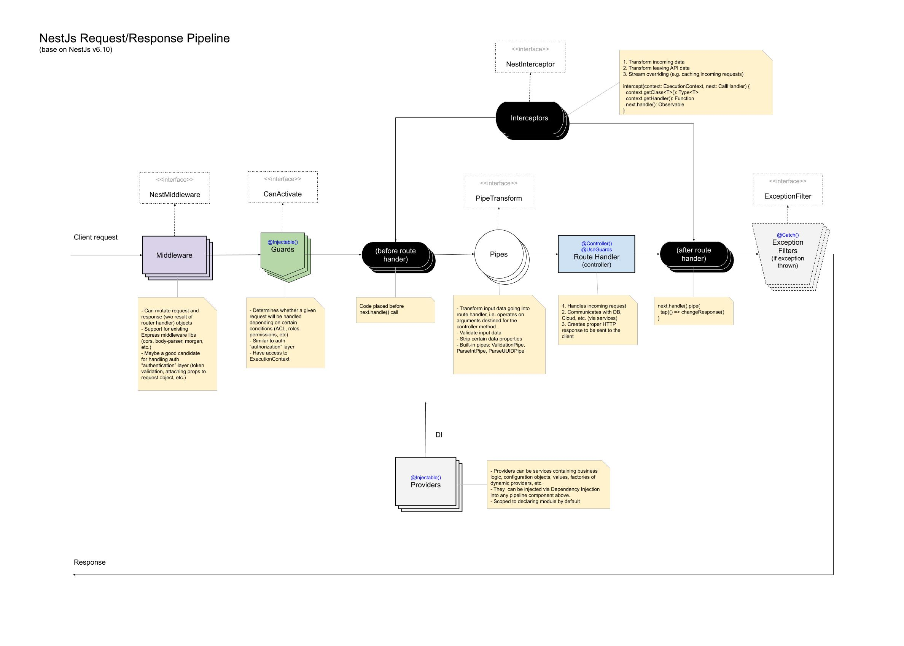

# Application Lifecycle

It is important that we build a modular approach for our application. This means we need to adhere to NestJS principles for input validation, authentication, route handling etc, in short, the [request lifecycle](https://docs.nestjs.com/faq/request-lifecycle).
This eventually makes it so that we can reuse these different modules of our application in other applications.
On top of this we are able to define and test every module in a unified and simplistic manner, such that we can apply these tested modules on all aspects of our application without having the need to test that specific module application.
The lifecycle also ensures that when a component fails, all other components after this will not be executed, opposed to managing this ourselves, where we would need to catch specific errors and construct the error response ourselves.

Please consult the following flowchart while reading the explanations. If you need further explanations, links have been placed on all concepts to the more extensive [NestJS documentation](https://docs.nestjs.com/).


<br />

## Modules

[Modules](https://docs.nestjs.com/modules) are not defined within our request lifecycle. This is because they do not handle any data, but purely exist to abstract a certain collection of code (module) from the rest of the application. It handles which components are required for this module to function through [dependency injection](https://docs.nestjs.com/modules#dependency-injection). Every NestJS application contains at least a root module, in our case contained in [`/src/manage-panel.module.ts`](../modules/ManagePanelModule.html#source) which is the top level definition of how our application is composed. Modules at a lower level assure that we adhere to the [SOLID](https://en.wikipedia.org/wiki/SOLID) principle.

## Middleware

The [middleware](https://docs.nestjs.com/middleware) acts as the receiving point for our client requests. The middleware is an injectable which needs to implement the `NestMiddleware`. It can be used for authentication, logging and a lot of other applications, it also supports Express middleware libraries.
Guards, interceptors, pipes and filters can be thought of as "special" middleware as well. With as main difference that they are dedicated to a specific purpose, while nestjs middleware can apply purposes which are missing from the default nestjs components. We have implemented our auth service as a middleware component, take a look at [`/src/modules/auth/auth.service.ts`](../injectables/AuthService.html#source) to understand how these are defined and take a look at [`src/manage-panel.resolver.ts`](../classes/ManagePanelResolver.html#source) to see how they are implemented.

## Guards

[Guards](https://docs.nestjs.com/guards) have a single responsibility. They determine whether a given request will be handled by the route handler or not, depending on certain conditions (like permissions, roles, ACLs, etc.) present at run-time. Guards should always implement `CanActivate` (or extend guards which already do this). We used guards for our GraphQL authorisation. Take a look at [`/src/modules/auth/gqlauth.guard.ts`](../injectables/GqlAuthGuard.html#source) to see how they are defined and take a look at [`/src/modules/user/user.resolver.ts`](../classes/UserResolver.html#source) to see how they are implemented. Aside from basic authorisation it is also possible to define roles through guards, to ensure that every user only has access to the resources for which he was approved.

## Interceptors

[Interceptors](https://docs.nestjs.com/interceptors) can be thought of as a before and/or after application of logic on the requested resource. When handling the resource, the route handler and providers have no knowledge of the application of logic by the interceptors. They simply handle the resource which was requested. The interceptor is able to translate the request, apply transformations to this request and then hand it over to the handler. After the handler has done his work (generally by using providers), the interceptor again intercepts the response to translate and transform this back to the format the client was expecting. We have used interceptors to implement pagination on our resources. The client requests a certain count, limit and offset on a collection of resources, the interceptor then translates this to a list of resources which can be retrieved from the handler. The handler returns and the interceptor wraps this response in a pagination object, containing metadata about the count, limit and offset on top of the requested resource itself. Take a look at [`/libs/common/ag-grid/src/ag-grid.interceptor.ts`](../injectables/AgGridInterceptor.html#source) to see how the interceptor is defined and take a look at [`/libs/boxedout/user/user.resolver.ts`](../classes/UserResolver.html#source) (getUserList) to see how it is implemented.

## Pipes

[Pipes](https://docs.nestjs.com/pipes) are used both for transformation and for validation. NestJS offers a lot of builtin pipes, like `ValidationPipe`, `ParseIntPipe`, `ParseBoolPipe` etc. Normally pipes are implemented as interceptors and guards are, through a `@UsePipes` decorator. In Graphql however all params (query/mutation fields) are automatically validated and NestJS offers you "custom decorators" to do further operations on graphql parameters. Therefore you will not find the use of `@UsePipes` in our project, but we have implemented pipes through custom decorators, contained within the [`/src/common/graphql/decorators`](https://github.com/boxedout/boxed-out-boilerplate/blob/dev/src/common/graphql/decorators/gqlfields.decorator.ts) folder. The use of these custom decorators can inferred from [`/src/modules/user/user.resolver.ts`](../classes/UserResolver.html#source). As you can see we use the decorators which have been defined in the decorators folders and pass them a map defined through the user type in [`/src/modules/user/dto/user.type.ts`](../classes/UserType.html#source).

## Route handler (controller/resolver)

The route handler handles translation of REST endpoints to our internal structure. In the case of GraphQL we however do not have [controllers](https://docs.nestjs.com/controllers) but [resolvers](https://docs.nestjs.com/graphql/resolvers). These function in the same manner, but all connect to a single endpoint, and therefore do not require path or method specifications. To prevent overlap in resource naming, we still define this path and method in the resource name, in the following manner: `namespace_methodResource(List)`, for example `ManageUser_getUser` and `ManageUser_getUserList`. You should have seen the resolver for the user multiple times now, since it shows the implementation of most other components. Make sure you fully understand what [`/src/modules/user/user.resolver.ts`](../classes/UserResolver.html#source) does after consulting the following two chapters, since you should now be able to comprehend this most basic implementation of the NestJS framework. If you still have problems, consult the links contained within this document to read up extra on these subjects.

## Providers

[Providers](https://docs.nestjs.com/providers) can both be internal and external. A provider is essentially a class annotated with an `@Injectable()` decorator. Providers provide our resolvers with the resources they need, since resolvers only handle routing and applying previously discussed components. All logic for storing and retrieving data from the database should be contained within the provider. On top of this we can inject external providers when we need resources from outside of our ecosystem.

## Exception Filters

[Exception filters](https://docs.nestjs.com/exception-filters) make it possible to handle errors without explicitly catching and rethrowing them. This is necessary as well, since some of our components like guards and pipes might throw errors as well. Because the logic for this is mostly handled by the framework we need an encompassing manner of catching errors. The default global exception filter in NestJS automatically returns the following response on unrecognised exceptions:

```
{
  "statusCode": 500,
  "message": "Internal server error"
}
```

To learn more about how to use or add Exception Filter please take a look to the [Error Handling Documentation](./error-handling.md).
